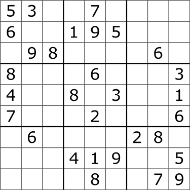
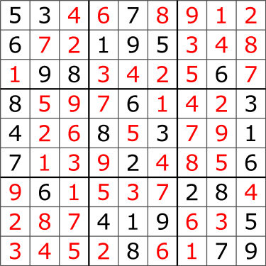
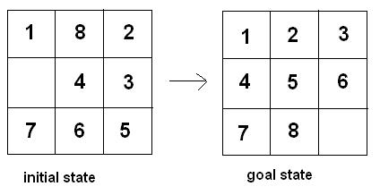

## Homework Assignment 04 (11/12)

This assignment is primarily focused on functions and multidimensional arrays. The assignment is worth a total of 120 points. If you have any questions or need any help, please visit us during office hours and/or post questions on Piazza.

> If you need to post any of your actual source code on Piazza for any reason, **please** be sure to tag the post as being *visible to instructors only*, so that you don't inadvertently share code with others and violate class rules.

### Pair programming
-----
Pair programming is a common software development technique where two programmers share a single computer/workstation during development. One "driver" controls the keyboard and types the actual code, the "navigator" checks each line of code as it is typed in, looking mistakes errors such as spelling, syntax, or logical errors. The two should switch roles frequently in order to keep a fresh perspective on the current problem. This technique is meant to allow both programmers to bring their own knowledge and ideas to the task, catch potential bugs, and improve the overall quality of the code.

For this assignment, we are allowing you the option to pick  a *single* partner with whom you will work to complete the assignment. We feel that this will be a good chance, not only to experience pair programming, but to hopefully gain knowledge by working with someone else.
> Note: Please do **not** divide up the assignment ie. "you do numbers 1 and 3, I'll do numbers 2 and 4". That is not the point of giving you this opportunity and you will not learn the material as well by doing it.

If you choose to work with a partner, please make sure to submit together to Gradescope as a group. You may **not** share your code with others outside your group.

### Format details
---
Your submission will be tested and graded by an autograder, for this reason it cannot be stressed enough that your program must *exactly* follow the specifications for input and output upon submission.

For each problem you will create a program, you are free to design your own helper functions in order to implement your solution.

> As in the last assignment, you will read input from `std::cin` and print output to `std::cout`. Any print (`cout`) statements other than the expected output **must** be removed prior to submission. Pay special attention to formatting, such as number of whitespaces when printing more complex entities.

For additional details on expected submission instructions, please refer to the **Submission and Grading** section at the bottom of the document.

### Programs
---
We discussed how to store a 2D array in class using a double pointer, however if you wish to explore different options, there are some other methods you may use for this assignment. The `std::vector` library for C++ is a very useful tool which is quite easy to learn and adapt to, there is documentation available online and your TAs can answer any questions you may have about it on Piazza. Alternatively, if you want to try something professional which makes matrices easy to pass to functions, you could try implementing a 2D array via a 1D array using row-major order. If you wish to attempt either of these, feel free to post any questions on the forum.

#### 1. `sudoku_checker`
##### What is Sudoku?
Sudoku is a logic-based, combinatorial number-placement puzzle. Similar number placement games have existed throughout recorded history, however, the modern version you are likely familiar with was popularized in "1986 by the Japanese puzzle company Nikoli" [Wikipedia].


##### The Rules
The objective is to fill a 9×9 grid with digits so that each column, each row, and each of the nine 3×3 subgrids that compose the grid (also called "boxes", "blocks", or "regions") contain all of the digits from 1 to 9 without repetition or omission. [Wikipedia]

That is to say:
- Each column should contain the values 1-9
- Each row should contain values 1-9
- Each box should contain the values 1-9
- Each value should appear exactly once in each of the above

A Sudoku puzzle



The solved puzzle



##### The Assignment
For this assignment, you will be given a filled out Sudoku board state and you will check whether the board has been properly solved or not according to the given rules.
>Note: We are **NOT** asking you to solve a game of Sudoku, that is a much more complex task which requires recursive backtracking at a minimum (perhaps in a later assignment).

##### Input
As input, you will be given a filled Sudoku board composed of a 9 x 9 grid where each cell is a value 1-9.

For example, the solved puzzle case above:
```
5 3 4 6 7 8 9 1 2
6 7 2 1 9 5 3 4 8
1 9 8 3 4 2 5 6 7
8 5 9 7 6 1 4 2 3
4 2 6 8 5 3 7 9 1
7 1 3 9 2 4 8 5 6
9 6 1 5 3 7 2 8 4
2 8 7 4 1 9 6 3 5
3 4 5 2 8 6 1 7 9
```

##### Your Task
Once you have read and stored the puzzle, you should test each of the rules to make sure that the condition is satisfied (1-9 in each block, no two of the same value in the same column etc.).

##### Output
Your output should be `Solution is good!` if the solution satisfies all criterion and `Wrong solution!` if one of the rules is not followed.

#### 2. `game_of_life`
##### What is The Game of life?
Not to be confused with Hasbro's *The Game of Life*, this problem refers to British mathematician John Conway's famous cellular automation. The term 'cellular automation' refers to a space (in this case a grid) of cells, which continually transform themselves to create new patterns and states, based on the states of neighboring cells, by following a discrete set of mathematical rules. The simulation models cells living, dying, and multiplying over multiple generations.

Here is an example of one such simulation in a larger scale


##### The Rules
1. Any **live** cell with *fewer than two* live neighbors dies (as if by underpopulation).
2. Any **live** cell with *more than three* live neighbors dies (as if by overpopulation/overcrowding).
3. Any **live** cell with *two or three* live neighbors lives, unchanged, to the next generation.
4. Any **dead** cell with *exactly three* live neighbors will come to life (as if by reanimation or birth).

> Neighbors refer to the eight cells adjacent to any given cell in a grid, with the exception of border cells.

##### The Assignment
For this assignment, we are asking you to implement Conway's Game of Life using a two-dimensional array as a grid in which to store the cells. Live cells are denoted as `*` characters, dead cells are denoted by the `.` character.

##### Input
As input, you will be given a line containing the number of rows, number of columns, and number of generations to simulate in the form `m n g` followed by `m` lines containing the initial state of the grid. `3 <= m,n <= 20` and `0 <= g <= 50`

For example, a 4 x 5 grid on which 7 generations of life should be simulated, would be given as follows:
```
4 5 7
. * * . .
. * . . .
* * * . *
. . . . *
```

You should store this initial grid state in a multidimensional array as discussed in class.

##### Your Task
The initial state (generation 0) stored in a grid.
```
. * * . .
. * . . .
* * * . *
. . . . *
```
You should then compute the next generation (generation 1) by applying the rules to the previous generation grid (generation 0 in this case).

The state of the grid after computing generation 1 should be as follows:
```
. * * . .
. . . * .
* * * * .
. * . * .
```
> Important Note: "[Generation n] is created by applying the [...] rules simultaneously to every cell in [generation n-1] — births and deaths happen simultaneously" (Wikipedia). This means that when applying rules to n-1 to compute/create n, you should at no point change values in n-1, only observe them. Only after n has been seeded should you change n-1.

Repeat the above process `g` times until your grid is in its final state. This means that if you receive a `g = 0`, your initial state and final state would be the same.

##### Output
Your output should be the final state of the grid after `g` generations printed to `std::cout` in the format above.
> Note: Your printed grid should contain *no* trailing whitespace at the end of each row.


#### 3. `sliding_puzzle`
##### What is a Sliding Puzzle?
Sliding puzzles are a type of puzzle where the player must arrange tiles or pieces in order to achieve a particular end configuration. The pieces are most often, numbers, letters, or sections of a picture. In this case we will be using an 8-puzzle.



##### The Rules
1. Each 8-puzzle has tiles labeled 1-8 and one empty space denoted by a 0.
2. The commands given signify where you should attempt to move the empty space in relation to its current position.
3. The only moves you are allowed to make are swapping the empty space with an adjacent tile to it.
4. If asked to make an impossible swap (ie. move the blank tile out of the grid bounds), __don't__ terminate the program, simply ignore that command.

##### The Assignment
For this assignment, we are asking you to take an 8-puzzle and follow a sequence of movement commands UP, DOWN, LEFT, and RIGHT. At the _end_ of the sequence, you should check whether the puzzle has been solved.

##### Input
As input you will be given some initial board state in the form of a sequence of numbers where 0 corresponds to the "blank" tile. The example below would be the form of the "initial state" example above. After that will be a sequence of commands "UP", "DOWN", "LEFT", and "RIGHT" represented by characters on a single line separated by spaces. (The example command sequence below has no connection to the example graphic)
```
1 8 2 0 4 3 7 6 5
D R R R U L
```

##### Your Task
After storing the initial board state, you will perform the commands given (so long as they are allowed, as specified in the rules section). Run through all the commands, then check whether the puzzle is solved correctly.

##### Output
Your output should be `Solution is good!` if the puzzle is in solved order as specified above, and `Wrong solution!` if the puzzle is not in the "goal state" specified above.


#### 4. `k_nearest_neighbors`
##### What is Nearest Neighbors?
Nearest Neighbors is a classification algorithm which is very useful in certain fields of computer science, especially in Machine Learning and Artificial Intelligence. Its goal is to classify some unknown object based on the k objects closest to it. There are many different ways to calculate closeness between two objects.

##### The Assignment
For the purpose of this assignment, we will be asking you to do a simplified version of the algorithm using 2D Cartesian points and Euclidean distance measurement to calculate closeness.

##### The Rules
1. Each point given will have a unique (x,y) coordinate.
2. Each point will be classified as either `R` for Red or `B` for Blue.
3. There will never be a tie as to what an object will be classified as.

##### Input
As input you will be given on the first line `n` and `k` followed by `1 <= n <= 100` lines each containing a pre-classified point. `n` is the number of pre-classified points given, ` 1 <= k <= n` is the number of nearest neighbors you will use to classify your unknown point. Each of the pre-classified points will be represented on separate lines in the form `x y c` where `x` and `y` are the Cartesian coordinates of the point `-100.0 <= x,y <= 100.0` and `c` is its label, either `R` or `B`. Finally on the last line you will receive, in the format `x y`, the Cartesian coordinates of the point which should be classified. For example:

```
10 3
3.57 -3.18 R
84.91 27.69 B
93.40 4.62 B
-67.87 9.71 B
75.77 82.35 B
-74.31 -69.48 R
39.22 31.71 R
-65.55 95.02 B
17.12 3.44 B
70.60 -43.87 R
25.60 -10.15
```

##### Your Task
Once you have this information, you should find and record the point closest to point p (the unknown), then find the next closest point, etc. until you have found k points. Count how many times labels `R` and `B` were found, point p gets classified as whichever label occurred more.
> Remember that the rules ensure one label will always occur more than the other.

##### Output
Your output should be a single char either `R` or `B` which your point p has been classified as.

### Submission and Grading
---
To submit your solution to Gradescope, simply select the files you wish to submit and use the "drag and drop" option.  Name your files `main_q.cpp`, where `q` is the question number you are solving. Your programs will be automatically graded. For each of the questions you either pass the test cases (full points) or not (zero points).

> You must be reminded that students caught cheating or plagiarizing will receive `no credit`. Additional actions, including a failing grade in the class or referring the case for disciplinary action, may also be taken.
