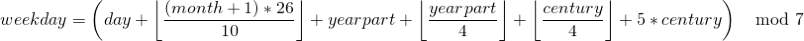
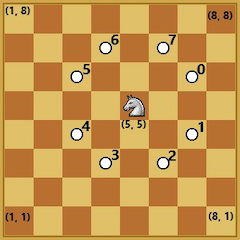

## Homework Assignment (makeup) (10/24)

Your submission will be tested and graded by an autograder, for this reason it cannot be stressed enough that your program must exactly follow the specifications for input and output upon submission.

If the question specifies that it will take a `double` then a `char` you must follow this input order or else fail the test.  For this assignment, you should use the `int` data type for regular whole numbers and as the default when a number format is not specified, you should use the `double` data type for any question which specifies decimal or floating point numbers, and `char` for single letter variables or input.

The output will always be some form of string printed out on a single line. It will always end with some form of newline character; either `std::endl` or `'\n'`.  Whenever printing a `double` you should always have exactly 4 decimal places; if your decimal number is `3.1415926534`, you should print it as `3.1416`. If your number is `0.0` or `0`, it should print as `0.0000`. You can use `<iomanip>` to accomplish this.

### Questions

#### 1. `average`
Read in three decimal values and print the average of the three in the format: `The average of <num1>, <num2>, and <num3> is <average>`.

#### 2. `temperature`
This program will read in two arguments, first a _decimal_  number and second, a single letter, either `C` or `F`. The decimal represents a temperature, the character represents which system that degree is in (`50.0` `F` would be 50.0 degrees Fahrenheit etc.). This program should take the given number and convert it to a temperature in the other system. The output string format should be `<input num> degree(s) <input system> is equal to <new num> degree(s) <other system>`. Eg. input `0` `C` would give the string `0.0000 degree(s) C is equal to 32.0000 degree(s) F`. You can assume that either `F` or `C` will be given for input, no need to account for invalid input.

#### 3. `day_of_the_week` 
This program takes in three integers, representing `day` `month` `year` in that order, and should output the day of the week associated with the given date. The formula used to calculate the date is:



   * _day_ is the day of the month (1, 2, 3, etc.).
   * _century_ is equal to (_year_ / 100). For 2019, century would be 20.
   * _yearpart_ is the year within the century (_year_ mod 100). For 2019, year would be 19.
   * _month_ is the month of the year, we typically associate the months as January = 1, February = 2, March = 3, etc. This is the case for this program for all cases **except** for January and February. Due to the way the formula works, specifically January and February must be entered into the above formula as months 13 and 14 of the _previous_ year. This is to say that if you wanted to know which day of the week January 5, 1997 fell on, you would need _month_ = 13, _day_ = 5, _year_ = 1996 when the values enter the formula. Your program should take them in as regular format `5 1 1997` and treat them differently once they have been read.
   * The value _weekday_ resulting from the equation will be a number [0,6] where Saturday = 0, Sunday = 1, etc.

The output of your program should be a single string name of the appropriate weekday. If the formula outputs 0, your output will be `Saturday` and so on.

#### 4. `x_of_stars`
Write a program that reads in an integer `0 < n < 10` as input and prints out an X of that height made of `*` characters. If the input is not an odd number, it should print `Sorry, not odd`. See examples below for input values of `n = 3` and `n = 5` respectively.
``` text
* *
 *
* *
```
``` text
*   *
 * *
  *
 * *
*   *
```

#### 5. `draw_triangle_3`
Write a program which reads in three integers `a, b, c`, such that `0 < {a, b, c} <= 20` and `a <= b`. The program should print the `+` character `a` times, then `a + c` times, then `a + c + c` times, and so on. This pattern should repeat while the line is at most `b` characters long. At that point, the pattern is repeated backwards. For example input `4 7 1` will output:
```
++++
+++++
++++++
+++++++
+++++++
++++++
+++++
++++
```

#### 6. `loan_payment`
 Write a program which will read three `double` values: `0 < loan <= 10^10` (the initial loan), `0 <= interest <= .5` (the monthly interest), and `0 < payment <= loan` (the monthly payment) respectively. We will assume that your monthly payment always takes place *after* the loan accrues any interest for that month. We will also assume that there will be a minimum of one month required to pay off any loan. Your program should print out the number of months required to pay off the loan. For example, input `500.0` `0.05` `499.0` will output `2`.

> It is worth noting that a 50% interest rate is just an upper bound, you should be aware of this during your local testing as you could easily encounter an infinite loop (scenarios in which the loan will never be paid off). However, you can assume that no such test cases will appear on Gradescope.

#### 7. `char_pyramid`
Write a program that reads a single character `'A' <= ch <= 'Z'` as input and prints out a pyramid of characters starting at `A` until it reaches the pyramid's base and stops. See examples below for input values of `ch = 'A'` and `ch = 'C'` respectively.
```text
A
```
```text
    A
  A B A
A B C B A
```

#### 8. `rgb_to_hex`
Write a program which reads in three integers `r, g, b` representing RGB values ranging from `0` to `255` (inclusive) and prints out their hexadecimal representation. For example, if the input is `245 13 0` the output would be `#F50D00`.

#### 9. `armstrong`
Write a program that reads in an integer `0 < n <= 10^9` as input and checks whether `n` is an *armstrong number* or not. An armstrong number is a number that is equal to the sum of its own digits raised to the power of the number of digits. For example `1634` is an armstrong number, since `1^4 + 6^4 + 3^4 + 4^4 = 1634`. Your program will print `True` if `n` is an armstrong number, and `False` otherwise.

#### 10. `a_lovely_rug`
Write a program which reads in an integer `0 < n <= 10` prints out this nice rug pattern. See examples below for input values of `n = 2`, `n = 3`, and `n = 4` respectively.
```text
#========#
|  <><>  |
|<>....<>|
|<>....<>|
|  <><>  |
#========#
```
```text
#============#
|    <><>    |
|  <>....<>  |
|<>........<>|
|<>........<>|
|  <>....<>  |
|    <><>    |
#============#
```
```text
#================#
|      <><>      |
|    <>....<>    |
|  <>........<>  |
|<>............<>|
|<>............<>|
|  <>........<>  |
|    <>....<>    |
|      <><>      |
#================#
```

#### 11. `circular_prime`
A number is called a *circular prime* if all rotations of its digits form a prime. For example, the number `197` is a circular prime because all possible rotations of its digits: `[197, 971, 719]` are prime numbers. Write a program that reads in an integer `1 <= n <= 10^5` as input and prints `True` if `n` is a circular prime and `False` otherwise.

#### 12. `knight_moves`
Write a program which will read in a sequence of integers.  The first two values (`x y`) represent the starting location of a knight piece on a chess board, considering the coordinate system displayed in the figure below. The succeeding numbers represent consecutive moves for the knight. Knight moves are encoded as numbers between `0` and `7` inclusive, as shown in the figure.



Your program should continuously track the location of the knight after each move until there are no more moves to read. Your program should then print out the final location of the knight in the format `<x> <y>`. If at any point during runtime, the knight is told to move off of the board, your program should print `Invalid sequence` and terminate.

For example, if the input is `5 5 0 3 5 6`, your program would output `3 7`.  If the input is `5 5 1 2 0 5 4` it would output `Invalid sequence`, because move `0` would not be possible.

> It might be useful to use standard input redirection from files for dealing with this problem (contact your TAs)

### Submission and Grading
You will submit a single zip file named `pam.zip` through Gradescope. Your zip archive must contain your source files only. For each of the problems, create a file called `main_<num>.cpp` where `<num>` is the question number itself with no leading zeros. Your programs will be automatically graded. For each of the questions you either pass the test cases (full points) or not (zero points).

> You must be reminded that students caught cheating or plagiarizing will receive `no credit`. Additional actions, including a failing grade in the class or referring the case for disciplinary action, may also be taken.
