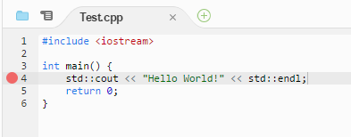
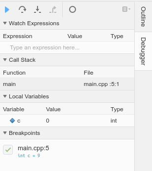

# Lab 05: Debuggers and functions

Welcome to CSC 211 Lab 05. Your goal for this lab will be to gain a better understanding of debuggers and functional programming. **Be sure to read and follow all instructions unless otherwise specified.** Some of the language used here has been adopted from the *OpenDSA Data Structures and Algorithms Modules Collection text* text. Create a `lab-05.txt` document to record all of your lab answers in and implement all of your `.cpp` programs in your IDE.

1. Step-by-Step Debugging of "Hello World" [50 minutes] <br>
    1.1 Setting a Breakpoint<br>
    1.2 Running in Debug Mode<br>
    1.3 Debugging "Hello World"<br>
    1.4 Debugging Another Program<br>
2. The Call Stack<br>
    2.1 Stack Frames<br>
    2.2 Getting Started With the Stack<br>
3. Functions [50 minutes]<br>
    3.1 Examples <br>
    3.2 Order Matters<br>
    3.3 Problem Set <br>
4. Submission [5 minutes]

## Part 1. Step-by-Step Debugging of "Hello World" [50 minutes]

First, lets make a quick *hello world* program. With that file, we'll be able to explore some basic features of the CS50 IDE debugger.

Create and save a `hello.cpp` program with the following contents.


```c++
#include <iostream>

int main()
{
	std::cout << "Hello World!" << std::endl;
	return 0;
}
```


Now you will run this program in debug mode; allowing you to run code line by line, or chunk by chunk, depending on where your breakpoints are. While the code is running, you can update variables and function calls, thus allowing you to find errors in your code more easily.

### 1.1 Setting a Breakpoint

Before you start debugging you must set a breakpoint in your code. In debug mode, your program will run normally until it reaches the breakpoint. You are now in control of when your program executes its lines of code. To set a breakpoint, click  on the light gray space in your file window that is to the left of the numbers column, on the line that you wish to start debugging. A big red circle should appear after clicking once, with an example shown below:

<center></center>

### 1.2 Running in Debug Mode

Now that you've set a breakpoint, we must run the program in debug mode. You can do this by running the `debug50` command. However, in order to run debug50 we need to compile our code with deugging flags, this is as simple as adding the -g flag in the compile command. Using `g++ -g hello.cpp -o hello` should produce an adequate exectable. For our example the following will run your program in debugging mode:

```bash
$ debug50 hello
```

### 1.3 Debugging "Hello World"

You should notice that your program stops executing at the breakpoint, and the line with the breakpoint is highlighted yellow. When debugging, the highlighted line is the next line of code to be executed. To the right you should see the debugging window, as shown below.   


<center></center>

The top row of buttons allow you to navigate and execute your code. From Left to Right:
- The play button, or the resume button, will stop debugging and run your program normally until it reaches another breakpoint, end of program, or a runtime error, and then starts debugging again;
- The Step Over and Step Into buttons will both execute the next line of code. They perform differently when the next line of code includes a function. The Step Over button will execute the function call completely and finish executing the current line. The Step Into button will instead move the debugger to that function's code and continue debugging there;
- The Step Out button can be pressed when you are inside a function call to finish the function call and return to the original line of code that called that function;
- The Deactivate All Breakpoints button is self explanatory.  

### 1.4 Debugging Another Program

Before we debug another program with our debugger tool, let's become the debugger ourselves. Take look at the code below and trace this program on paper, keeping track of each variable value.

```c++

#include <iostream>

int pow(int, int);

int main() {
	int x = 2;
	int y = 4;
	int z = pow(x, y);
	std::cout << x << "^" << y << "=" << z << std::endl;
	return 0;
}

/* A Naive method for calculating powers */
int pow(int a, int b) {
	int result = 1;
	while (b != 0) {
		result *= a;
		--b;
	}
	return result;
}

```

Let's take a look at how you did. Now, use the CS50 debugging tool to trace the values of this program's variables. Set a breakpoint on the first line of main() `int x = 2;` and run the debugger.

:white_check_mark: Question 1. What is the current value of x reported by the debugger at the breakpoint we set? Why is it that value?

:white_check_mark: Question 2. Was your program trace similar to the debugger? If not, what were the differences and why?


# Part 2. The Call Stack

> In computer science, a call stack is a stack data structure that stores information about the active subroutines of a computer program.
This kind of stack is also known as an execution stack, program stack, control stack, run-time stack, or machine stack, and is often shortened to just "the stack".
Although maintenance of the call stack is important for the proper functioning of most software, the details are normally hidden and automatic in high-level programming languages.
- [Wikipedia](https://en.wikipedia.org/wiki/Call_stack)

## 2.1 What is the Call Stack?

The Call Stack, or more commonly just *The Stack*, can be thought of as a deck of notecards.
Whenever a function begins, it creates a new card to be put on top of the stack of existing cards (hence the name).

We call these notecards `stack frames`. A stack frame stores data for a function call, essentially
local variables related to that function.

In each stack frame the function allocates a small space for every variable it will need, along with any parameters it is given, and a space for whatever the function will return.


For a short visualization of how the stack works, please step through [PythonTutor](https://goo.gl/zekNw3).
The Python Tutor is a great resource if you're having trouble visualizing exactly what's happening in your code, and it's free!
Make good use of it.

## 2.2 Getting started with the stack

Begin by compiling and running the starter code below with no additional flags (no output, or debugging quite yet).

```c++
#include <iostream>
int plus_one(int x) {
    return x + 1;
}
int plus_two(int x) {
    return plus_one(x + 1);
}
int main() {
    int result = 0;
    result = plus_one(0);
    result = plus_two(result);
    std::cout << result;
}
```


:white_check_mark: Question 3: Examine what was printed out to the console. Where did this value come from? Describe how you think the call stack processed each operation (what was the order in which values were added to the stack?)<br>


Lets test our theory by running this same code in [PythonTutor](https://goo.gl/zekNw3). 

:white_check_mark: Question 4: Were you surprised by the activity in the stack on pythonTutor? What was different from your original guess? <br>


# Part 3. Functions [50 minutes]

## 3.1 What is a function?

A function is simply a block of statements that operates on certain parameters, and returns a value(though this last part isn't always true). In most modern high level languages functions serve as means of wrapping together repetitive code that you may use several times in your programs functionality. The syntax for a function in C++ is as follows:
```c++
<return type> <function name>(<parameters>) {
    <statements>
    <return statement> //again this is optional for a certain type of function(you'll see this later)
}
```

All of you have seen and used a function already this semester possibly without realizing. The main() function is a special function in the C++ language and holds all of the statements to be run when the program is called. Lets analyze an example of the main function.

```c++
#include <iostream>

int main() {
    std::cout << "Hello World!" << std::endl;
    return 0;
}
```

:white_check_mark: Question 5. What is the return type of the main function?

:white_check_mark: Question 6. What are the parameters to the main function?

As an example lets think about something you've been asked to do already this semester, testing if a number is odd / even. Code like this is something you might like to have when developing a program revolving around odd or even numbers and as a result writing out the statements everytime you want to test a number for being even. So lets say for example, I want to write a program that will endlessly prompt the user for input and output whether or not it is even(terminating if the user enters 0). My code might look something like this:

<!---Assignment 2 has a problem about taking in input from cin while it has information we can change the inputs of the code below to exemplify this (while(cin >> var))--->

```c++
#include <iostream>
int main() {
    int input;
    while (1) {
        std::cout << "Enter a number: " << std::endl;
        std::cin >> input;

        if (!input) break;
        else {
            if (!(input % 2)) std::cout << "Even" << std::endl;
            else std::cout << "Odd" << std::endl;
        }
    }
    return 0;
}
```

We could also instead opt to move our functionailty for even number testing into a function, in which case we would have code like this:

```c++
#include <iostream>

bool is_even(int n) {
    if (!(n % 2)) return true;
    else return false;
}

int main() {
    int input;
    while (1) {
        std::cout << "Enter a number: " << std::endl;
        std::cin >> input;

        if (!input) break;
        else {
            if (is_even(input)) std::cout << "Even" << std::endl;
            else std::cout << "Odd" << std::endl;
        }
    }
    return 0;
}
```

As you can see this makes our code much more readable, as anyone who reads this program will know that is_even() tests a number for being even, even if they have no idea what the % operator does. We could even extrapolate this further and reduce our main function to a single line.

```c++
#include <iostream>

bool is_even(int n) {
    if (!(n % 2)) return true;
    else return false;
}

void run() {
    int input;
    while (1) {
        std::cout << "Enter a number: " << std::endl;
        std::cin >> input;

        if (!input) break;
        else {
            if (is_even(input)) std::cout << "Even" << std::endl;
            else std::cout << "Odd" << std::endl;
        }
    }
}

int main() {
    run();
    return 0;
}
```

:white_check_mark: Question 7. What do you think it means for a fuction to return void?

:white_check_mark: Question 8. Do you think that void functions can use return statements?

:white_check_mark: Question 9. Copy the following code into your IDE, it should throw a syntax error at compile time. What does this error mean to you?

```c++
#include <iostream>

int main() {
    run();
    return 0;
}

bool is_even(int n) {
    if (!(n % 2)) return true;
    else return false;
}

void run() {
    int input;
    while (1) {
        std::cout << "Enter a number: " << std::endl;
        std::cin >> input;

        if (!input) break;
        else {
            if (is_even(input)) std::cout << "Even" << std::endl;
            else std::cout << "Odd" << std::endl;
        }
    }
}

```

## 3.2 ORDER MATTERS 

You should have seen an error along the lines of `error: 'run' was not declared in this scope`. Why is this? Well its pretty self explanatory, when the main function goes to make a call to run(), it hasn't been declared yet. But we defined run() below main() why is it not declared? Well that is where the section title comes in, ORDER MATTERS. Since main() came before any declaration of run(), and since C++ reads from top to bottom the line that declares and defines run as function hasn't been executed before main tries to use it. What does this mean for us as programmers? Well it means we need to either declare all functions before main() or we need follow a strict hierarchy of needs between functions. That is rather verbose, so assume the following psuedo code layout has some fully functional functions in it for basic mathematic operations (addition, multiplication, exponents) if we want to use our functions without declaring them our structure might look something like this:

```c++
int add(int a, int b) {
    //add a to b
    //return result
}

int mult(int a, int b) {
    //add a to a sum, b times
    //return sum
}

int exp(int a, int b) {
    //multiply a times a b times
    //return result
}

int main() {
    std::cout << exp(2, 6) << std::endl;
}
```

This code shows the "strict hierarchy of needs between functions" mentioned earlier. Since exponentiation is repeated multiplication and multiplication is repeated addition, our code has to declare and define addition first, the multiplication,then exponentation. This may seem fine for this example, but this method of handling function dependancies is considerably cumbersome on just about anything that isn't basic math operations.

The second and far more common (as well as far more friendly) is to declare any functions that the program will have ahead of main, in which case our code might look like this:

```c++
int add(int a, int b);
int mult(int a, int b);
int exp(int a, int b);

int main() {
    std::cout << exp(2, 6) << std::endl;
}

int exp(int a, int b) {
    //multiply a times a b times
    //return result
}

int mult(int a, int b) {
    //add a to a sum, b times
    //return sum
}

int add(int a, int b) {
    //add a to b
    //return result
}
```

Note that C++ allows you to `declare` a function before it is defined, just like you've done with variables in the past. Following this structure allows you to write the functions in whatever order you want. These declarations of functions are called `function headers` and should at least include the return type of the function, and the types of its parameters. Meaning we could write the header for add() as either `int add(int a, int b)` or `int add(int, int)`

:white_check_mark: Program 1. Write three functions in C++ to implement simple addition, multiplication, and exponentiation as with the function headers seen above and test them. Each function should use **your** base math functions (that is to say that mult() should us add(), exp() should use mult(), etc.) 

## 3.3 Parameter Passing

C++ offers two ways to pass parameters to functions `passing by value` and `passing by reference`. `Passing by value` is the default in most languages and makes a copy of the data provided in that parameter and stores it as a local variable. Whereas `passing by reference` uses an alias for the variable provided in the argument. That is to say it makes another name that can refer to the same variable outside the scope of the function. The following is a code example of this concept:

```c++
#include <iostream>
void mystery(int& b, int c, int& a) {
   a ++;
   b --;
   c += a;
}

int main() {
   int a = 5;
   int b = 10;
   int c = 15;
   mystery(c, a, b);
   std::cout << a << ' ' << b << ' ' << c << ‘\n’;
   return 0;
}
```

:white_check_mark: Question 10. What is the output of the above code?


<!--- just a point i wanted to make that i commented out so i could put it in a more sensible place 

Functions are extremely good for making code more readable, though they are also really good for segmenting your code, and therefore debugging. As if we isolate functionality then we can test our function extensively and rule out the possibility that the function is whats causing faulty outputs.
--->

## 3.4 Problem Sets

:white_check_mark: Question 11. Write a function that accepts 3 integers: *a*, *b*, and *c*. If *a* is even, return the **sum** of all ints between *b* and *c*. Otherwise, return the **product** of all ints between *b* and *c*.

:white_check_mark: Question 12. Write a function that accepts a decimal number and returns that number in Binary.

:white_check_mark: Question 13. Write a function that accepts an integer *n* and returns the # of digits. Ex. 1234 returns 4.

:white_check_mark: Question 14. Write a function that accepts an integer *n* and returns the reverse of the integer. Ex. 1234 returns 4321. Hint: Use your solution from Question 13 to help you solve this!

:white_check_mark: Question 15. Write a function that accepts an integer *n* and displays the pyramid from Lab 4 program8.cpp with *n* rows. Note: This will cause the numbers to enter double digits, which will throw off the pyramid. Bound the output of the print statements between 0 and 9. Ex. 11->1, 12->2, 37->7, 50->0.

# Part 4. Submission [5 minutes]

Each group will submit a single **.zip file** named `lab-05.zip` containing all your answers to the lab questions in your `lab-05.txt` and all of your `.cpp` source code files on [Gradescope](http://gradescope.com) **before the end of your lab section**. **All submissions should be made by a group/team.** *Individual submissions will not be accepted.* Instructions to download your `lab-05.txt` file can be found in the IDE introduction page that you read in lab-01. For your convenience, that page is relinked [here](https://cs50.readthedocs.io/ide/online/).
