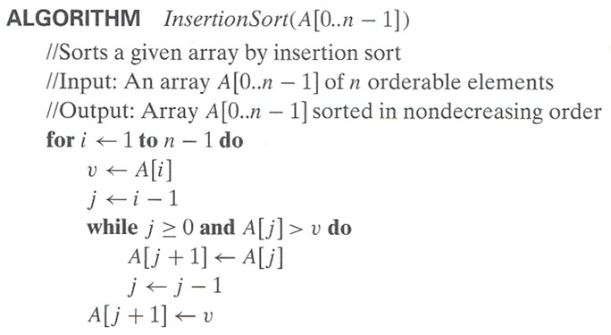

# Lab 07: Sorting

Welcome to CSC 211 Lab 07. Your goal for this lab will be to gain a better understanding of sorting algorithms. **Be sure to read and follow all instructions unless otherwise specified.**  Create a `lab-07.txt` document to record all of your lab answers in and implement all of your `.cpp` programs in your IDE.

1. Bubble Sort Slides [20 minutes]  
2. Selection Sort Slides [20 minutes]  
3. Insertion Sort [50 minutes]  
4. Submission [5 minutes]

# Part 1. Bubble Sort Slides [20 minutes]

:white_check_mark: Question 1. Considering the bubble sort algorithm we've just discussed, how many swaps are necessary to sort the following sequence? `[2, 13, 6, 9, 3, 10, 8, 1, 5, 11]`

# Part 2. Selection Sort Slides [20 minutes]

:white_check_mark: Question 2. Considering the selection sort algorithm we've just discussed, how many swaps are necessary to sort the following sequence? `[2, 13, 6, 9, 3, 10, 8, 1, 5, 11]`

# Part 3. Insertion Sort [50 minutes]

Consider the pseudocode below:

Implement this algorithm in a file named `insertionSort.cpp`.

:white_check_mark: Question. Is this algorithm faster than the other two? Justify your answer.  

# Part 4. Submission [5 minutes]

Each group will submit a single **.zip file** named `lab-07.zip` containing all your answers to the lab questions in your `lab-07.txt` and all of your `.cpp` source code files on [Gradescope](http://gradescope.com) **before the end of your lab section**. **All submissions should be made by a group/team.** *Individual submissions will not be accepted.* Instructions to download your `lab-07.txt` file can be found in the IDE introduction page that you read in lab-01. For your convenience, that page is relinked [here](https://cs50.readthedocs.io/ide/online/).
