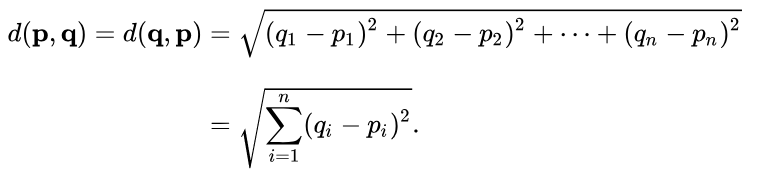

# Lab 11: Classes

Welcome to CSC 211 Lab 10. Your goal for this lab will be to gain a better understanding of advanced recursion methods and its uses. **Be sure to read and follow all instructions unless otherwise specified.**  Create a `lab-11.txt` document to record all of your lab answers in and implement all of your `.cpp` programs in your IDE.

1. Class Overview<br>
2. Fields<br>
3. Methods<br>
4. Exercises<br>

# 1. Class Overview

Up until now we have been solving problems from a data-focused perspective. That is, we model a problem in terms of the raw data presented and manipulate that data directly to solve the problem at hand. 

Object-Oriented Programming is all about solving a problem by creating accurate abstract representations of real-world phenomena, and having those abstractions interact with each other to produce a solution. Classes are the primary tool that allows us to model these abstractions. Anything that you can interact with in the real world can be abstracted and modeled as a class. Once done, the Object-Oriented Programming language we are in will allow us to instantiate (create an instance of) this modeled abstraction as an object via its **constructor** for use in interacting with other objects.

C++ splits the declaration of a Class into two files: the header file (.hpp, for declarations) and the source file (.cpp, for definitions.) In the following example, we **declare** a "Player" Class, and the Constructor used to create an object from this Class. In the Constructor, we print out the string "New Player Created!". Now we will be alerted every time a Player Object is instantiated. In the *main()* function, we see two ways of instantiating an object. The former creates an object at compile time, the latter creates an object during run time. They are both created using the same constructor, so if we run this code we'll see "New Player Created!" appear twice.

```c++
//Player.hpp
#pragma once
#include <iostream>

class Player
{
private:

public:
	Player();
};
```

```c++
//Player.cpp
#include "Player.hpp"

Player::Player() {
	std::cout << "New Player Created!" << std::endl;
}
```

```c++
//Main.cpp
#include "Player.hpp"

int main() {
	Player p1 = Player();
	Player* p2 = new Player();
}
```

# 2. Fields

While the above code shows how to create Objects from a Class' Constructor, the classes themselves aren't modeling much. Fields allow us to specify what data each instance of the Class (object) should contain. Each object's data is independant from all other objects, and proper practice has them listed as **private** so only that object can access the data contained within. Modifying our above examples, lets give the player some fields to represent their name, maxHP, currentHP, and how much damage they can deal.

```c++
//Player.hpp
#pragma once
#include <iostream>
#include <string>

class Player
{
private:
  	std::string name;
	int maxHP;
	int currentHP;
	int damage;
public:
	Player();
	Player(std::string, int, int);
};
```

```c++
//Player.cpp
#include "Player.hpp"

Player::Player() {
  	this->name = "";
	this->maxHP = 0;
	this->currentHP = 0;
	this->damage = 0;
}

Player::Player(std::string name, int maxHP, int damage) {
  this->name = name;
	this->maxHP = maxHP;
	this->currentHP = maxHP;
	this->damage = damage;
}
```

```c++
//Main.cpp
#include "Player.hpp"

int main() {
	Player p1 = Player("Goku", 10, 5);
	Player* p2 = new Player("Vegeta", 8, 3);
}
```

A few things happened here. First, we changed our default constructor to initialize all fields to 0. Second, we created a new constructor that accepts two ints (for Health & Damage) and assigns the values given to that object's fields. Finally, we changed our object instantiation to use the new constructor, creating two Players each with different stats.

:white_check_mark: 1. The default constructor is not used in the above example, but I included it anyway. Do some independent learning to explain why.

# 3. Methods

Now that we have a class that contains data (fields), we can implement special functions to interact with that data. A function that belongs to an object is called a **method**. Remember from lecture that an important part of OOP principles is **encapsulation**, or data hiding. This is the principle that only an object should be able to directly access the data stored within it. If another object wishes to view/modify data belonging to another object, it must do so via a method. Lets write some quick accessor methods so we can view the data in each object. We'll need one to access each of the data fields we want to be able to access.

```c++
//Player.hpp
#pragma once
#include <iostream>
#include <string>

class Player
{
private:
  	std::string name;
	int maxHP;
	int currentHP;
	int damage;
public:
	Player();
	Player(std::string, int, int);
  	std::string GetName();
	int GetMaxHP();
	int GetCurrentHP();
	int GetDamage();
};
```

```c++
//Player.cpp
#include "Player.hpp"

Player::Player() {
  	this->name = "";
	this->maxHP = 0;
	this->currentHP = 0;
	this->damage = 0;
}

Player::Player(std::string name, int maxHP, int damage) {
 	this->name = name;
	this->maxHP = maxHP;
	this->currentHP = maxHP;
	this->damage = damage;
}

std::string Player::GetName() {
	return this->name;
}

int Player::GetMaxHP() {
	return this->maxHP;
}

int Player::GetCurrentHP() {
	return this->currentHP;
}

int Player::GetDamage() {
	return this->damage;
}
```

```c++
//Main.cpp
#include "Player.hpp"

int main() {
	Player p1 = Player("Goku", 10, 5);
	Player* p2 = new Player("Vegeta", 8, 3);

	std::cout << p1.GetName() << "\t" << p1.GetCurrentHP() << "\t" << p1.GetDamage() << std::endl;
	std::cout << p2->GetName() << "\t" << p2->GetCurrentHP() << "\t" << p2->GetDamage() << std::endl;
}
```

Notice the difference in how we access the players. For a regular structure, we can use the dot (.) operator. But if we're using a pointer, we must use the arrow (->) operator. This is a syntax difference in how pointers are treated (due to the need to de-reference), and is essentially a shortcut to the following:

```c++
	std::cout << (*p2).GetName() << "\t" << (*p2).GetCurrentHP() << "\t" << (*p2).GetDamage() << std::endl;
```

:white_check_mark: 2. Implement a new method *GetStats()* that will return a string containing a player's name and stats. It will replace the code used to do so in *main()* with a much neater:

```c++
  std::cout << p1.GetStats() << std::endl;
  std::cout << p2->GetStats() << std::endl;
```

# 4. Exercises

:white_check_mark: Question 3: Write a new method *TakeDamage()* that will decrease a Player's *currentHP* by a value passed in.Make Player 1 attack Player 2 and display the updated stats. *Hint: Use the GetDamage() function to get Player 1's damage!*

:white_check_mark: Question 4: Write a class that creates Cartesian coordinates in a 3D space (x, y, z). Below are the class member variables and methods you need to implement.
```c++
        int x;
        int y;
        int z;

        //Constructs a point object with X, Y, Z properties
        Point(int x, int y, int z);

      //Sets the X, Y, and Z properties of a point Object
        void setX(int x);
        void setY(int y);
        void setZ(int z);

        //Gets the X, Y, and Z properties from a point Object
        int getX();
        int getY();
        int getZ();

        //Returns a cartesian coordinate representation of a point Object
        // aka = (x,y,z)
        std::string toCord();

        //Calculates the Euclidean Distance of two points
        double euDistance (Point p2);

```


A formal definition for Euclidean distance can be found below:

The Euclidean distance between points p and q is the length of the <a src="https://en.wikipedia.org/wiki/Line_segment"> line segment </a> connecting them (qp).

In Cartesian coordinates, if p = (p1, p2,..., pn) and q = (p1, q2,..., qn) are two points in Euclidean n-space, then the distance (d) from p to q, or from q to p is given by the Pythagorean formula:



:white_check_mark: Question 4: Visit this [class definition](https://www.partow.net/programming/bitmap/index.html) and use it to create different bitmap objects.

:white_check_mark: Question 5: Write a 'car' class that creates car objects with the below properties and make 3 different car objects initialized with different properties.

        std::string make;
        std::string model;
	std::string color;
        int year;
	double mileage;


        //Constructs a car object
        Car(std::string make, std::string model, std::string color, int year);

      //Setters for objects of type car
        void setMake(std::string someMake);
        void setModel(std::string someModel);
        void setColor(std::string someColor);
	void setYear(int someYear);
	void setMileage(double someMileage);

        //Getters for objects of type car
        std::string getMake();
        std::string getModel();
        std::string getColor();
        int getYear();
	double getMileage();

        //Prints all member variables to console
        void printDetails();


```


