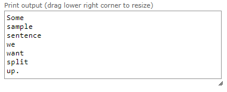

# Lab 13: Vectors, File I/O, Command Line Arguments and String Streams

Welcome to CSC 211 Lab 13. The major focus of today's lab will be discussing STL containers and how to write programs that accept command line arguments. 

1. STL Containers [30 mins]<br>
1.1 Vectors
2. Working with Files [20 mins]
3. Command Line Arguments [30 mins] <br>
 3.1 argc and argv<br>
 3.2 The Unix cat command<br>
4. Stringstream [30 mins]
5. Submission [5 mins]<br>

## 1. STL Containers

The STL (Standard Template Library) is a library of data structures for storing data. There are several data structures included in this library each with their own advantages and disadvantages. 

> This lab will focus on vectors for simplicity's sake however knowing when to use which structure is a powerful skill in Computer Science, and learning the exact time it takes for each of these data structures to run is content covered in CSC 212. So it may be useful to research on your own time (http://www.cplusplus.com/reference/stl/)

Vectors are a handy stand-in for dynamic arrays in C++, and are extremely useful when we are receiving a variable amount of data. The syntax to define a vector of integers in C++ is as follow: 

```c++

#include <vector>

int main() {
	std::vector<int> vec;
}

```

The data type specified inside of the `< >` is the data type of a single "container" within our vector. Which means any value added to our vector must be capable of conversion to an integer. At this point it may prove useful to look into the various methods available to a [vector](http://www.cplusplus.com/reference/vector/vector/) as there are several methods that can be used to add elements to a vector. The example code will use `.push_back() ` but it is just as valid to use `.insert()` or `.emplace()` (emplace is used to contruct objects to add to the vector). The following code will add 10 elements to the vector `vec`:

```c++

for(int i = 0 ; i < 10 ; i++){
	vec.push_back(i);
}

```

From this point forward, vec will function exactly as an array would, supporting access to its elements with `[]` operator with the added benefit of being able to add elements to the vector at a later point in the program. So if was useful to make an array of 11 or more elements at some point or more we can use vec in place of a new array. I will use the following code block to write a simple function to print out all elements of a vector in order to highlight some slight oddities about the STL:

```c++

void print_vector(std::vector<int> vec) {
	size_t vec_size = vec.size();

	for(size_t i = 0 ; i < vec_size ; i++) {
		std::cout << vec[i] << std::endl;
	}
}

```

Now this code is likely very familiar with the exception of a `size_t` data type. The logical question is what is what data does a `size_t` store. Investigating the documentation of `.size()` method reveals that a `size_t` or `size_type` is an unsigned integral type. Meaning that `size_t` is just a renamed `unsigned int`. This is thanks to feature in modern languages named type definitions but thats a topic for individual research. 

### Vector Programming problems

:white_check_mark: Program 1. Write a program to accept integer input from the user (use cin) and then create a vector of the size specified by user. Also initialize this array with each elements index. I.e. the first element should have a value of 0 and the last should have a value of n-1 .

:white_check_mark: Program 2. Write a program to accept integer input from the user until the user enters a 0, then print out all of the values entered in reverse order. 

Example:
```
1
2
3
4
5
0
5
4
3
2
1
```

## 2. Working with Files

There are a hand full of ways to work with files in C++, but today, we are going to consider how we can work with the contents of a .txt file by inspecting every character in the file.

To work with a file, we first need a way to open the file and reference the file. This can be done with the below command.

```C++
FILE *fp = fopen(fname, "r");
```

Here, we are simply creating a pointer fp that points to a FILE object. The `fopen` function has two arguments, the file name and "r" which lets us read the file.

Now that we have fp, we have some way of referencing the data in our file fname. We can test to make sure that the file that we just tried to open actually exists with the below command

```C++
if (fp != NULL){}
```

If fname (the file we wanted to open) did not exist on our machine, fp would have been set to NULL.

Just like how c-style strings have a null-terminator to let us know that we've reached the end of a string, files have an end-of-file (`EOF`) flag.

We can loop through the contents of fname by making sure at each iteration of our loop, we are not at the end of our file. This is achieved using the `feof` command. Notice that feof takes a file pointer as an argument.

```C++
while(!feof(fp))
```

Finally, we can inspect each character if our .txt file using `fgetc` as seen below.

```c++
char c = fgetc(fp);
```

Once done working with you file, the file stream must be closed with

```c++
fclose(fp);
```

You might find the below function helpful in the next section of lab. This function opens a file, prints out every character in that file, and then closes that file.

Spend some time reading and understanding this function before you use it. Feel free to test the below function with a .txt file. 

```C++
#include <iostream>
// Function: Takes a file name and takes the contents of the file and prints all the contents to the 
// command line. 

void readFile(char *fname){

    // First, we open the file and assign the file name to an pointer.
    // http://www.cplusplus.com/reference/cstdio/fopen/?kw=fopen

    FILE *fp = fopen(fname, "r");

    // We check if the file is valid (aka, if there's something in the array there). 
    // If a file was not successfully opened, fopen will have returned a null pointer to fp, thus
    // we can use fp to check if there is a file.

    if (fp != NULL){

    // Now, while we're NOT at the EOF.
    // http://www.cplusplus.com/reference/cstdio/feof/?kw=feof

    while(!feof(fp)){

    // We continulously get the character, and cout it, until we hit the EOF. 
    // http://www.cplusplus.com/reference/cstdio/fgetc/

    char c = fgetc(fp);

    if(c != EOF){
        std::cout << c;
        }

    }

    // Close the file
        fclose(fp);

    }
}

```

## Command Line Arguments

### 3.1 argc and argv

For your C++ programs to accept command line arguments, you will need to use the signature for main() that allows command-line arguments as seen below.

```c++
int main(int argc, char *argv[]) {

}
```

So what do the parameters in the main function represent? We can get some insightful information about the parameters just by looking at each parameter type. We know that `argc` is just an integer and `argv` is an array of pointers.

**argc** or *argument count* holds the number of arguments your executable is receiving.

**argv** or *argument vector* is a array of strings where each string is an argument passed to your C++ program. 

To make this more clear, consider the program below.

```C++  
#include <iostream>

int main(int argc, char *argv[]) {

    //printing the value in argc
    std::cout << argc << std::endl;

    //printing every element in argv
	if (argc > 1) {
		for (int i=0; i<argc; i++) {
			std::cout << argv[i] << " ";
		}
	}
	 std::cout << std::endl;
}

```
Compiling this example.cpp program with

```bash
g++ example.cpp -o example
```

We can now pass arguments to our executable program with the following notation.

```bash
./example hello world!
```
As you might have expected, all this program does is print out the value inside argc (in this case 3 because 3 arguments were provided) and then individually prints our each argument value. In this case, the output above execution is

```bash
3
./example hello world! 
```
>Note: Now that we've defined arg and argv in detail, you should now be able to implement programs that accept command line arguments

### 3.2 The Unix cat command

One of the many command-line utilities available on Linux (and other Unix-like systems) is cat, which is short for concatenate. In its simplest form, cat can display the contents of a text file; it can also be used to concatenate together many text files.

For this part of the lab, you are going to write your own version of cat.

Before you proceed, you should first play with cat on the command line. Get into your Docker environment and

* Type `cat /etc/hosts` and notice that the contents of the file /etc/hosts
are printed out.
* Now, type `cat /etc/hosts /etc/hosts` and see if you can make sense of
the output.
* Now, try typing `cat /etc/hosts /etc/hosts > test.txt`. Inspect test.txt by opening the file or running `cat test.txt`

:white_check_mark: Question 1. What is in the contents of test.txt? 

:white_check_mark: Question 2. Why is that information there?

What cat does is that it takes one or more filenames as command-line arguments. It prints out the contents of each file in turn. By using the Unix shell feature of **redirection** (the > character), we can combine all of those files into one file. Undoubtedly, you can imagine circumstances when this would be useful.


:white_check_mark: Program 3. Implement your own version of the unix *cat* command. Write a program that takes n text files as an argument (where 0 > n > 5) and prints the concatenated file contents to the terminal or redirects the concatenated file contents to another file.


## 4. Stringstream

A common task you'll be faced with throughout your career is parsing strings. The process of parsing strings is fairly straightforward, but could get tedious depending on how you implement it.

Regardless of the method, you first need to specify a **delimeter**, the character to mark splits in the string. The delimeter will be used to split your string into **tokens**, the individual substrings extracted from the original string.

A straight-forward way of implementing this is to set up a loop that goes from 0 until the first instances of your delimeter, use the **substring** function to extract the substring from 0 to the index of your delimeter, update your starting index, and repeat until the end of the string.

But as Christian mentioned during lecture a few weeks back; if there is a task commonly done then there is a very good chance modern programming languages have built-in ways to perform them. Enter c++'s [**stringstream**](http://www.cplusplus.com/reference/sstream/stringstream/)!

Using the *stringstream* class, we can construct a *stringstream* object and easily parse a string. After specifying a delimeter and creating a temporary location to hold our tokens, create a *stringstream* object and pass in the string you wish to parse as the parameter to the *stringstream* constructor.

Once you have the *stringstream* object ready, the rest of the work is done by the [**getline()**](http://www.cplusplus.com/reference/string/string/getline/) function. Viewing the documentation for *getline()* shows that it has a version with 3 arguments. These arguments (in order) are the input stream to read data from, the string to store the data read, and the delimiter to discard. 

Note that the documentation for *getline()* states that it returns the same value that gets stored into *is*, the string you are storing the data read from the *stringstream*. This allows us to place *getline()* inside of a while loop to repeatedly extract tokens from the string based on the delimiter until we reach the end of the string. The English equivalent of that line is "while getline() is still reading data from the *stringstream*".

```c++
int main() {
	std::string my_text = "Some sample sentence we want split up.";

	char delimeter = ' ';
	std::stringstream my_string_stream(my_text);
	std::string token;

	while (std::getline(my_string_stream, token, delimeter)) {
		std::cout << token << std::endl;
	}
}
```
Here is the output of the above code. Note that while this example only prints the tokens, you can do whatever you want with the data in *token* until the next time *getline()* is called.



:white_check_mark: Program 4. Complete this code to parse the integers out of this string and sum them.

```c++
#include <string>
#include <sstream>
#include <iostream>

int main() {
	std::string my_text = "5,10,15,20,25";

	std::cout << SumInts(my_text);
}

int SumInts(std::string input) {
	int sum = 0;

	return sum;
}
```

:white_check_mark: Program 5. Complete this code to parse the given string, and for each token add it to the appropriate vector. Be sure to remember pass-by-reference!

```c++
#include <string>
#include <sstream>
#include <iostream>
#include <vector>

void VectorsByReference(std::string input, std::vector<int>* int_vector, std::vector<std::string>* str_vector);

int main() {
	std::string input = "5-apple-15-mango-25-pineapple";

	std::vector<int> int_vector;
	std::vector<std::string> str_vector;

	//Call the function here

	for (int i = 0; i < int_vector.size(); i++) {
		std::cout << int_vector[i] << " ";
	}
	std::cout << "\n";

	for (int i = 0; i < str_vector.size(); i++) {
		std::cout << str_vector[i] << " ";
	}
	std::cout << "\n";
}

void VectorsByReference(std::string input, std::vector<int>* int_vector, std::vector<std::string>* str_vector) {
	// Apart from the single line where you call this function in main, this should be the only place you add code!
}
```

## 6. Submission [5 minutes]

Each group will submit a single **.zip file** named `lab-13.zip` containing all your answers to the lab questions in your `lab-13.txt` and all of your `.cpp` source code files on [Gradescope](http://gradescope.com) **before the end of your lab section**. **All submissions should be made by a group/team.** *Individual submissions will not be accepted.* Instructions to download your `lab-13.txt` file can be found in the IDE introduction page that you read earlier in the lab. For your convenience, that page is relinked [here](https://cs50.readthedocs.io/ide/online/).